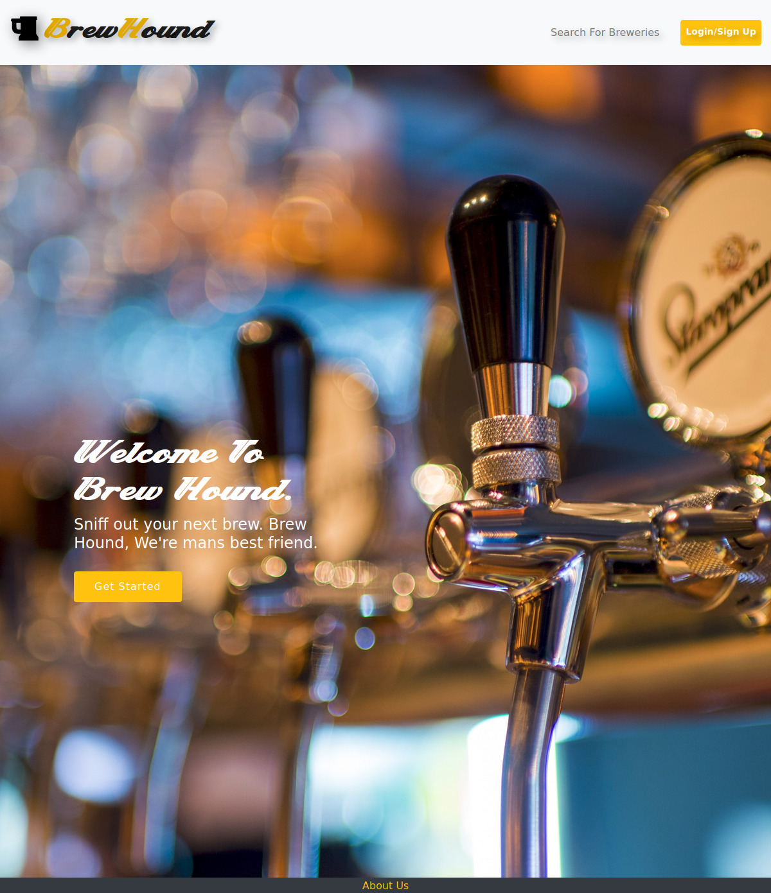

    
    
    
    
    
    
    

## brewhound-2

MERN (MongoDB, Express.js, React, and Node.js) stack <strong>_Brewery Finder_</strong> with GraphQL integration and multiple external API's. SPA (Single Page Application) utilizing react router, GraphQL and JWT (JSON Web Token) authentication. The backend application is deployed live @Heroku utilizing MongoDB Atlas.

#### Branches

- [x] [react-bootstrap](https://github.com/MBrassey/brewhound-2/commits/feature/react-bootstrap)
- [x] [meQuery](https://github.com/MBrassey/brewhound-2/commits/feature/meQuery)
- [x] [about-us](https://github.com/MBrassey/brewhound-2/commits/about-us)
- [x] [footer](https://github.com/MBrassey/brewhound-2/commits/footer)
- [x] [yelp-search](https://github.com/MBrassey/brewhound-2/commits/feature/yelp-search)
- [x] [merged-schemas](https://github.com/MBrassey/brewhound-2/commits/feature/merged-schemas)
- [x] [background](https://github.com/MBrassey/brewhound-2/commits/feature/background)
- [x] [map](https://github.com/MBrassey/brewhound-2/tree/map/test)
- [x] [modal](https://github.com/MBrassey/brewhound-2/commits/modal/test)
- [x] [SaveBrews](https://github.com/MBrassey/brewhound-2/tree/feature/SaveBrews)
- [x] [remove-unused](https://github.com/MBrassey/brewhound-2/commits/remove-unused)
- [x] [Dashboard](https://github.com/MBrassey/brewhound-2/commits/map/dashboard)
- [x] [memory-leak](https://github.com/MBrassey/brewhound-2/commits/bug/memory-leak)
- [x] [FX](https://github.com/MBrassey/brewhound-2/commits/feature/FX)
- [x] [fixes](https://github.com/MBrassey/brewhound-2/commits/saved/fixes)
- [x] [Readme](https://github.com/MBrassey/brewhound-2/commits/feature/Readme)

#### Table of Contents

* [Requirements](#Requirements)
* [Installation](#Installation)
* [Usage](#Usage)
* [Screenshots](#Screenshots)
* [Contributors](#Contributors)
* [Questions](#Questions)
* [License](#License)

#### Requirements

    MongoDB Community Server
    node
    npm

#### Installation

    install MongoDB
    npm install

#### Usage

    npm start
    browse to http://localhost:3000/
    browse to http://localhost:3001/graphql/

<h3>
:cyclone: Click the image(s) below to view the live <a id="Screenshots" href="https://brewhound-2.herokuapp.com/">webapplication</a>
</h3>

> Search Breweries
> 

> Login / SignUp
> 

> Saved Breweries (LoggedIn)
> 

> Setup
> 

> GraphQL Queries
> 

<h5>
Contributors
</h5>

### Matthew Ondrovic 

> Pending.
### Matthew Brassey 

> GraphQL Mutations & Queries, Save Breweries, User Dashboard Component, React Effects & Readme.
### Ryan Brown 

> React layout, Google map API, Scroll to Top, Bug-fixes.
### SupremeA 

> Pending.

#### Questions

Contact me at [matt@brassey.io](mailto:matt@brassey.io) with any questions or comments.

#### License

`brewhound-2` is published under the **CC0_1.0_Universal** license.

> The Creative Commons CC0 Public Domain Dedication waives copyright interest in a work you've created and dedicates it to the world-wide public domain. Use CC0 to opt out of copyright entirely and ensure your work has the widest reach. As with the Unlicense and typical software licenses, CC0 disclaims warranties. CC0 is very similar to the Unlicense.

